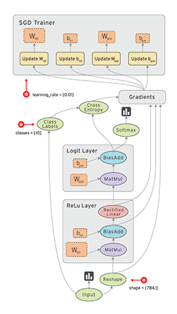
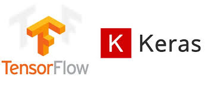
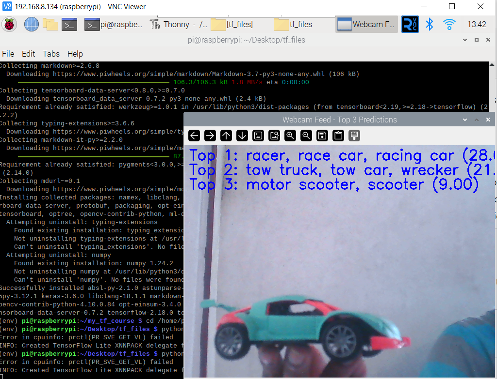

# Introduction to TensorFlow in Raspberry Pi Environment


As you are familiar with the basics of DNNs, CNNs, and object detection, let’s move on to the TensorFlow machine learning library!

So, what is [TensorFlow](https://www.tensorflow.org/), and why is it so popular among people in the ML domain?

TensorFlow is an open-source platform created by Google for machine learning (ML) and artificial intelligence (AI) applications. It’s designed to help developers and researchers build and train powerful ML models quickly and efficiently. By offering a set of flexible tools, libraries, and community resources, TensorFlow has become a go-to platform for everything from simple ML models to complex deep learning architectures.


## What is Tensor?


A **tensor** is a mathematical object that stores data in multiple dimensions. Think of it like a container for numbers, similar to a list or table. 

For example, a single number (like 5) is a 0-dimensional tensor, a list of numbers (like [1, 2, 3]) is a 1-dimensional tensor, and a grid of numbers is a 2-dimensional tensor (like a table). Tensors can even go beyond these dimensions, forming cubes or more complex shapes.

They’re essential in machine learning because they can hold vast amounts of data, like images or text, in ways that make it easy for computers to process and analyze. This flexibility makes tensors a key part of tools like TensorFlow, where they're used to train AI models.

[Reference](https://dev.to/mmithrakumar/scalars-vectors-matrices-and-tensors-with-tensorflow-2-0-1f66)

## How TensorFlow Works



At its core, TensorFlow works with tensors (multi-dimensional arrays) and uses these to perform operations on data. It organizes computations into graphs where nodes represent operations (like adding or multiplying) and edges represent data flowing between them. This makes TensorFlow incredibly efficient at handling large amounts of data, which is key in ML tasks.

[Reference](https://www.analyticsvidhya.com/blog/2016/10/an-introduction-to-implementing-neural-networks-using-tensorflow/)

## Key Highlights of TensorFlow:

1. **Powerful and Versatile**: Supports a wide range of tasks, from image recognition to speech processing, on small devices to large servers.

2. **Easy-to-Build Models with Keras**: Integrated Keras API simplifies neural network building for beginners and advanced users alike.

3. **Flexible Deployment**: Models can run on CPUs, GPUs, mobile devices, IoT, and browsers.

4. **Supports Advanced AI Research**: Offers low-level tools for deep customization, popular in both academia and industry.

## What is Keras and TensorFlow Relationship?



Keras is a high-level API that runs on top of TensorFlow, making it easier to build, train, and test deep learning models. Here’s how they relate:

**Keras as Part of TensorFlow**: Originally, Keras was an independent library that could work with multiple backends (including TensorFlow, Theano, and CNTK). Now, it’s officially integrated within TensorFlow as tf.keras, so users can access it directly in TensorFlow.

**Simplifying TensorFlow**: Keras provides a simple interface to TensorFlow’s powerful features, making it easier for beginners to build 
models without needing to dive into complex, lower-level TensorFlow code.

**Streamlined Workflow**: Keras allows for quick prototyping and testing of neural networks, while TensorFlow handles the more intensive computations and optimization behind the scenes.

## Building a Machine Learning Pipeline with TensorFlow


**Data Collection:** 

Use TensorFlow to gather and preprocess data efficiently from various sources (e.g., images).

**Data Preprocessing:** 

Leverage TensorFlow's tools for data cleaning, normalization, and augmentation to enhance model performance.

**Model Development:**

Utilize TensorFlow/Keras to build and train deep learning models with layers suitable for tasks like classification or detection.
Easy experimentation with architectures and hyperparameters to optimize model performance.

**Training and Evaluation:**

Utilize built-in functions for training models on large datasets with GPU acceleration.
Employ TensorFlow’s evaluation metrics to assess model accuracy and performance.

**Model Saving and Exporting:**

Use TensorFlow’s capabilities to save trained models in various formats (e.g., SavedModel) for easy deployment.

**Deployment on Raspberry Pi:**

Convert models to TensorFlow Lite format for efficient inference on the Raspberry Pi.
Utilize TensorFlow Lite to run predictions with low latency and minimal resource usage.

## Let's Create

Now let's talk about building a model, as well as training and validation. With the building blocks of CNNs in mind, let's create one using a dataset provided by TensorFlow. We will use Google Colab to build the model. You can explore datasets from TensorFlow at TensorFlow Datasets Overview. The dataset we will use is the CIFAR-10 dataset.

Here’s a simple explanation of what each line does in our model definition:

1.**models.Sequential()**: Initializes a sequential model, which allows you to build a linear stack of layers.

2.**model.add(layers.Conv2D(32, (3, 3), activation='relu', input_shape=(32, 32, 3)))**: Adds a convolutional layer with 32 filters, a 3x3 kernel, ReLU activation, and input shape for 32x32 RGB images.

3.**model.add(layers.MaxPooling2D((2, 2)))**: Adds a max pooling layer that reduces the spatial dimensions by taking the maximum value from each 2x2 region.

4.**model.add(layers.Dense(64, activation='relu'))**: Adds a fully connected (dense) layer with 64 units and ReLU activation to learn complex patterns.


## LiteRT (TensorFlow Lite)


LiteRT (short for Lite Runtime), formerly known as TensorFlow Lite (TFLite), is Google’s high-performance runtime specifically designed for on-device AI. It enables developers to deploy machine learning models on resource-constrained devices like smartphones, IoT devices, and single-board computers such as the Raspberry Pi. LiteRT provides a library of ready-to-run models covering a wide range of AI tasks. Additionally, it supports the conversion of models built in TensorFlow, PyTorch, and JAX to the LiteRT format through AI Edge conversion and optimization tools. For devices with limited resources, such as the Raspberry Pi, quantizing models is essential. Quantization reduces model size and memory usage by lowering the precision of model weights, which not only speeds up inference but also reduces the power consumption—making LiteRT ideal for edge AI applications.

[Reference 1](https://www.kaggle.com/code/ashusma/understanding-tf-lite-and-model-optimization)
[Reference 2](https://ai.google.dev/edge/litert/models/model_analyzer)


We have created a Colab tutorial to train a model using the CIFAR-10 dataset. You can run each cell one by one to get hands-on experience.

<a target="_blank" href="https://colab.research.google.com/github/KasunThushara/Tutorial-of-AI-Kit-with-Raspberry-Pi-From-Zero-to-Hero/blob/main/notebook/Chapter1/TensorFlow_CNN.ipynb">
  
</a>


In this lesson, we will set up a Raspberry Pi to run image classification using a pre-trained EfficientNet model and a standard dataset. 
This guide will walk you through the environment setup, model preparation, and running a live image classification script.

## Prepare Your Raspberry Pi

First, let's create a folder for your TensorFlow course and set up a virtual environment.

```bash
mkdir my_tf_course
cd my_tf_course
python -m venv --system-site-packages env
source env/bin/activate
```
## Install TensorFlow and OpenCV

```bash
pip3 install opencv-contrib-python tensorflow
```


## Download the EfficientNet Model and Labels

Download the [EfficientNet pre-trained model](../../models/Chapter2/2.tflite) and the [imagenet-classes.txt](../../models/Chapter2/imagenet-classes.txt) file (which contains the labels).
Copy these files to a folder on your Desktop named `tf_files`.


## Create the Python Script

```bash

import os
import cv2
import numpy as np
import tensorflow as tf

# Define paths as variables
MODEL_PATH = os.path.expanduser("/home/pi/Desktop/tf_files/2.tflite")  # Adjust as needed
LABELS_PATH = os.path.expanduser("/home/pi/Desktop/tf_files/imagenet-classes.txt")           # Adjust as needed

# Load the TFLite model
interpreter = tf.lite.Interpreter(model_path=MODEL_PATH)
interpreter.allocate_tensors()

# Get input and output details for the model
input_details = interpreter.get_input_details()
output_details = interpreter.get_output_details()

# Load labels (assuming they are in a text file, one label per line)
with open(LABELS_PATH, 'r') as f:
    labels = [line.strip() for line in f.readlines()]

# Function to preprocess image
def preprocess_image(image):
    image = cv2.resize(image, (224, 224))
    image = np.expand_dims(image, axis=0).astype(np.uint8)
    return image

# Function to get top 3 predictions
def get_top_3_predictions(interpreter, image):
    interpreter.set_tensor(input_details[0]['index'], image)
    interpreter.invoke()
    
    output = interpreter.get_tensor(output_details[0]['index'])
    output = np.squeeze(output)
    top_3_indices = output.argsort()[-3:][::-1]
    return top_3_indices, output[top_3_indices]

# Start webcam capture
cap = cv2.VideoCapture(0)

while True:
    ret, frame = cap.read()
    if not ret:
        break
    
    image = preprocess_image(frame)
    top_3_indices, top_3_probs = get_top_3_predictions(interpreter, image)
    
    # Display the predictions with class names
    for i, (idx, prob) in enumerate(zip(top_3_indices, top_3_probs)):
        label = labels[idx] if idx < len(labels) else "Unknown"
        cv2.putText(frame, f"Top {i+1}: {label} ({prob:.2f})", (10, 30 + i * 30),
                    cv2.FONT_HERSHEY_SIMPLEX, 1, (255, 0, 0), 2)
    
    cv2.imshow('Webcam Feed - Top 3 Predictions', frame)
    if cv2.waitKey(1) & 0xFF == ord('q'):
        break

cap.release()
cv2.destroyAllWindows()

```

## Run the Script

Navigate to the folder where your Python file (tflesson1.py) is saved.

```bash
cd /home/pi/Desktop/tf_files
```


Run the Python script to start the webcam feed with predictions.

```bash
python tflesson1.py
```
