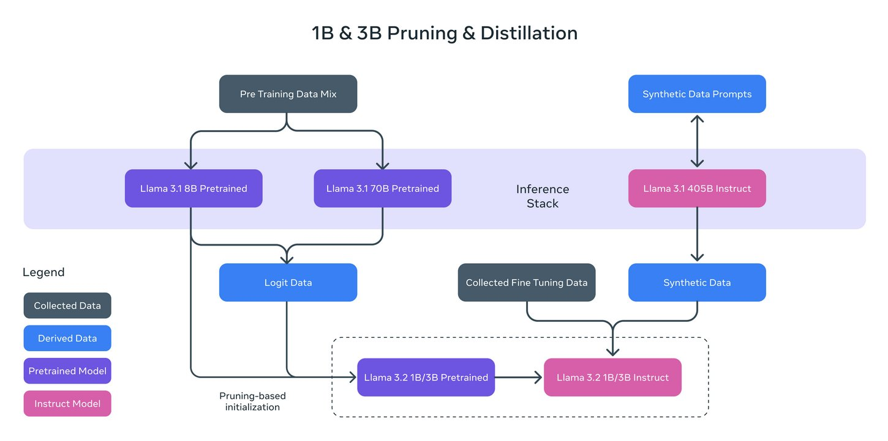
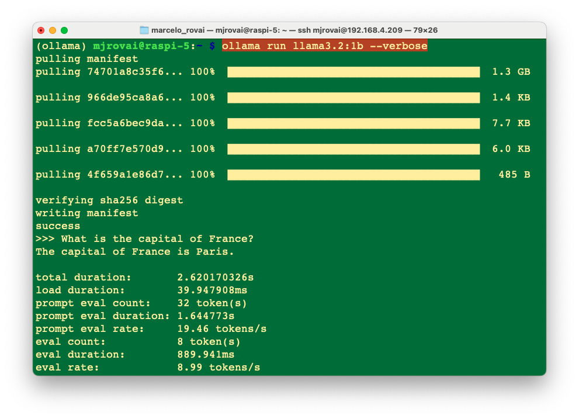
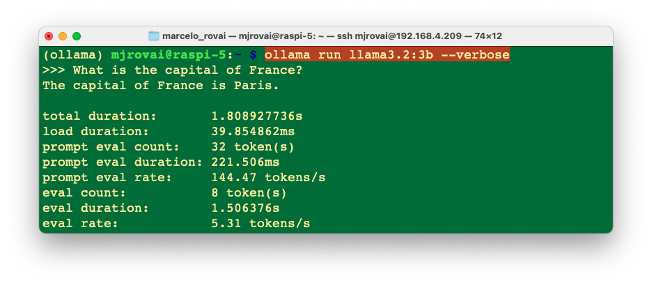

# Meta Llama 3.2 1B/3B

## Introduction


Let's install and run our first small language model, [Llama 3.2](https://ai.meta.com/blog/llama-3-2-connect-2024-vision-edge-mobile-devices/) 1B (and 3B). The Meta Llama, 3.2 collections of multilingual large language models (LLMs),  is a collection of pre-trained and instruction-tuned generative models in 1B and 3B sizes (text in/text out). The Llama 3.2 instruction-tuned text-only models are optimized for multilingual dialogue use cases, including agentic retrieval and summarization tasks. 

The 1B and 3B models were pruned from the Llama 8B, and then logits from the 8B and 70B models were used as token-level targets (token-level distillation). Knowledge distillation was used to recover performance (they were trained with 9 trillion tokens). The 1B model has 1,24B, quantized to integer (Q8_0), and the 3B, 3.12B parameters, with a Q4_0 quantization, which ends with a size of 1.3 GB and 2GB, respectively. Its context window is 131,072 tokens. 



## Install Ollama 

Please refer to this [article](https://github.com/Seeed-Projects/Tutorial-of-AI-Kit-with-Raspberry-Pi-From-Zero-to-Hero/blob/main/articles/Chapter%204%20-%20Large%20Language%20Model/Setup_Ollama_on_RaspberryPi.md)

## Install and run llama


```bash
ollama run llama3.2:1b
```

Running the model with the command before, we should have the Ollama prompt available for us to input a question and start chatting with the LLM model; for example, 

`>>> What is the capital of France?` 

Almost immediately, we get the correct answer: 

`The capital of France is Paris.` 	 

Using the option `--verbose` when calling the model will generate several statistics about its performance (The model will be polling only the first time we run the command).



Each metric gives insights into how the model processes inputs and generates outputs. Here’s a breakdown of what each metric means:

- **Total Duration (2.620170326s)**: This is the complete time taken from the start of the command to the completion of the response. It encompasses loading the model, processing the input prompt, and generating the response.
- **Load Duration (39.947908ms)**: This duration indicates the time to load the model or necessary components into memory. If this value is minimal, it can suggest that the model was preloaded or that only a minimal setup was required. 
- **Prompt Eval Count (32 tokens)**: The number of tokens in the input prompt. In NLP, tokens are typically words or subwords, so this count includes all the tokens that the model evaluated to understand and respond to the query.
- **Prompt Eval Duration (1.644773s)**: This measures the model's time to evaluate or process the input prompt. It accounts for the bulk of the total duration, implying that understanding the query and preparing a response is the most time-consuming part of the process.
- **Prompt Eval Rate (19.46 tokens/s)**: This rate indicates how quickly the model processes tokens from the input prompt. It reflects the model’s speed in terms of natural language comprehension.
- **Eval Count (8 token(s))**: This is the number of tokens in the model’s response, which in this case was, “The capital of France is Paris.”
- **Eval Duration (889.941ms)**: This is the time taken to generate the output based on the evaluated input. It’s much shorter than the prompt evaluation, suggesting that generating the response is less complex or computationally intensive than understanding the prompt.
- **Eval Rate (8.99 tokens/s)**: Similar to the prompt eval rate, this indicates the speed at which the model generates output tokens. It's a crucial metric for understanding the model's efficiency in output generation.

This detailed breakdown can help understand the computational demands and performance characteristics of running SLMs like Llama on edge devices like the Raspberry Pi 5. It shows that while prompt evaluation is more time-consuming, the actual generation of responses is relatively quicker. This analysis is crucial for optimizing performance and diagnosing potential bottlenecks in real-time applications.

Loading and running the 3B model, we can see the difference in performance for the same prompt;



The eval rate is lower, 5.3 tokens/s versus 9 tokens/s with the smaller model. 

When question about 

`>>> What is the distance between Paris and Santiago, Chile?`

The 1B model answered `9,841 kilometers (6,093 miles)`, which is inaccurate, and the 3B model answered `7,300 miles (11,700 km)`, which is close to the correct (11,642 km). 

Let's ask for the Paris's coordinates:

`>>> what is the latitude and longitude of Paris?`

```bash
The latitude and longitude of Paris are 48.8567° N (48°55' 
42" N) and 2.3510° E (2°22' 8" E), respectively.
```


Both 1B and 3B models gave correct answers. 