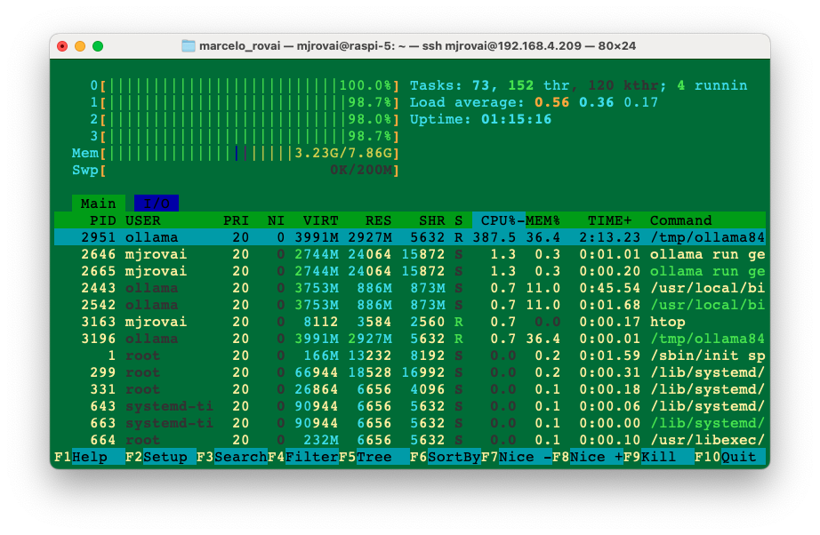

# Multimodal Models
## Introduction
Multimodal models are artificial intelligence (AI) systems that can process and understand information from multiple sources, such as images, text, audio, and video. In our context, multimodal LLMs can process various inputs, including text, images, and audio, as prompts and convert those prompts into various outputs, not just the source type.

We will work here with [LLaVA-Phi-3](https://ollama.com/library/llava-phi3:3.8b), a fine-tuned LLaVA model from Phi 3 Mini 4k. It has strong performance benchmarks that are on par with the original [LLaVA](https://llava-vl.github.io/) (Large Language and Vision Assistant) model.

The LLaVA-Phi-3 is an end-to-end trained large multimodal model designed to understand and generate content based on visual inputs (images) and textual instructions. It combines the capabilities of a visual encoder and a language model to process and respond to multimodal inputs.

## Install Ollama 

Please refer to this [article](https://github.com/Seeed-Projects/Tutorial-of-AI-Kit-with-Raspberry-Pi-From-Zero-to-Hero/blob/main/articles/Chapter%204%20-%20Large%20Language%20Model/Setup_Ollama_on_RaspberryPi.md)

## Install and run llava

Let's install the model:

```bash
ollama run llava-phi3:3.8b --verbose
```

Let's start with a text input:

```bash
>>> You are a helpful AI assistant. What is the capital of France?

As an AI language model, I can tell you that the capital of France 
is Paris. It's not only the largest city in the country but also 
serves as its political and administrative center. Paris is known 
for its iconic landmarks such as the Eiffel Tower, Notre-Dame 
Cathedral, and the Louvre Museum. The city has a rich history, 
beautiful architecture, and is widely considered to be one of the 
most romantic cities in the world.
```

The response took around 30s, with an eval rate of 3.93 tokens/s! Not bad!

But let us know to enter with an image as input. For that, let's create a directory for working:

```bash
cd Documents/
mkdir OLLAMA
cd OLLAMA
```

Let's download a 640x320 image from the internet, for example (Wikipedia: [Paris, France)](https://upload.wikimedia.org/wikipedia/commons/thumb/4/4b/La_Tour_Eiffel_vue_de_la_Tour_Saint-Jacques%2C_Paris_ao%C3%BBt_2014_%282%29.jpg/640px-La_Tour_Eiffel_vue_de_la_Tour_Saint-Jacques%2C_Paris_ao%C3%BBt_2014_%282%29.jpg):


Using FileZilla, for example, let's upload the image to the OLLAMA folder at the Raspi-5 and name it `image_test_1.jpg`. We should have the whole image path (we can use `pwd` to get it). 

`/home/mjrovai/Documents/OLLAMA/image_test_1.jpg`

If you use a desktop, you can copy the image path by clicking the image with the mouse's right button.  


Let's enter with this prompt:

```bash
>>> Describe the image /home/mjrovai/Documents/OLLAMA/image_test_1.jpg
```

The result was great, but the overall latency was significant; almost 4 minutes to perform the inference.


## Inspecting local resources

Using htop, we can monitor the resources running on our device. 

```bash
htop
```

During the time that the model is running, we can inspect the resources:



All four CPUs run at almost 100% of their capacity, and the memory used with the model loaded is `3.24GB`. Exiting Ollama, the memory goes down to around `377MB` (with no desktop). 

It is also essential to monitor the temperature. When running the Raspberry with a desktop, you can have the temperature shown on the taskbar:


If you are "headless", the temperature can be monitored with the command:

```bash
vcgencmd measure_temp
```

If you are doing nothing, the temperature is around `50°C` for CPUs running at 1%. During inference, with the CPUs at 100%, the temperature can rise to almost `70°C`.  This is OK and means the active cooler is working, keeping the temperature below 80°C / 85°C (its limit).

