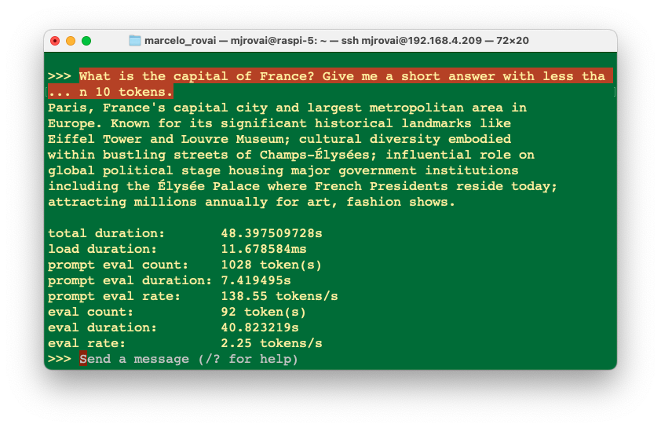

# Microsoft Phi3.5 3.8B
## Introduction
Let's pull a bigger (but still tiny) model, the [PHI3.5,](https://ollama.com/library/phi3.5) a 3.8B lightweight state-of-the-art open model by Microsoft. The model belongs to the Phi-3 model family and supports `128K token` context length and the languages: Arabic, Chinese, Czech, Danish, Dutch, English, Finnish, French, German, Hebrew, Hungarian, Italian, Japanese, Korean, Norwegian, Polish, Portuguese, Russian, Spanish, Swedish, Thai, Turkish and Ukrainian.

The model size, in terms of bytes, will depend on the specific quantization format used. The size can go from 2-bit quantization (`q2_k`) of 1.4GB (higher performance/lower quality) to 16-bit quantization (fp-16) of 7.6GB (lower performance/higher quality). 

Let's run the 4-bit quantization (`Q4_0`), which will need 2.2GB of RAM, with an intermediary trade-off regarding output quality and performance.

## Install Ollama 

Please refer to this (article)[./articles/Chapter 4 - Large Language Model/Setup_Ollama_on_RaspberryPi.md]


## Install and run Phi3.5
```bash
ollama run phi3.5:3.8b --verbose
```

> You can use `run` or `pull` to download the model. What happens is that Ollama keeps note of the pulled models, and once the PHI3 does not exist, before running it, Ollama pulls it.

Let's enter with the same prompt used before:

```bash
>>> What is the capital of France?

The capital of France is Paris. It' extradites significant 
historical, cultural, and political importance to the country as 
well as being a major European city known for its art, fashion, 
gastronomy, and culture. Its influence extends beyond national 
borders, with millions of tourists visiting each year from around 
the globe. The Seine River flows through Paris before it reaches 
the broader English Channel at Le Havre. Moreover, France is one 
of Europe's leading economies with its capital playing a key role 

...
```

The answer was very "verbose", let's specify a better prompt:



In this case, the answer was still longer than we expected, with an eval rate of 2.25 tokens/s, more than double that of Gemma and Llama. 

> Choosing the most appropriate prompt is one of the most important skills to be used with LLMs, no matter its size.

When we asked the same questions about distance and Latitude/Longitude, we did not get a good answer for a distance of `13,507 kilometers (8,429 miles)`, but it was OK for coordinates. Again, it could have been less verbose (more than 200 tokens for each answer). 

We can use any model as an assistant since their speed is relatively decent, but on September 24, the Llama2:3B is a better choice. You should try other models, depending on your needs. [🤗 Open LLM Leaderboard](https://huggingface.co/spaces/open-llm-leaderboard/open_llm_leaderboard) can give you an idea about the best models in size, benchmark, license, etc. 

> The best model to use is the one fit for your specific necessity. Also, take into consideration that this field evolves with new models every day,
