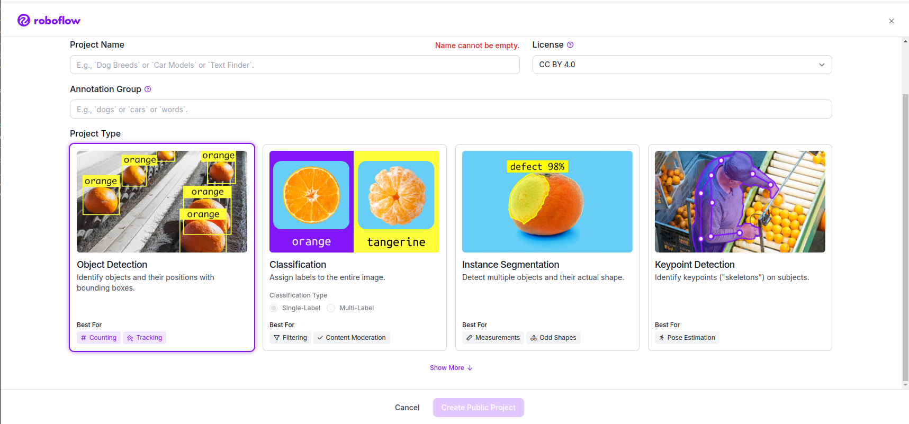
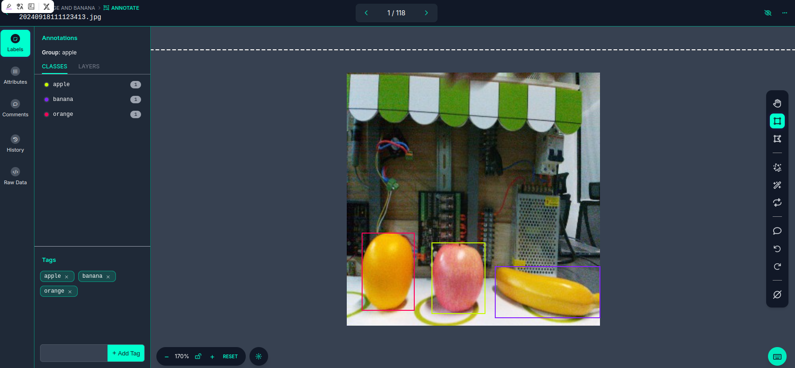
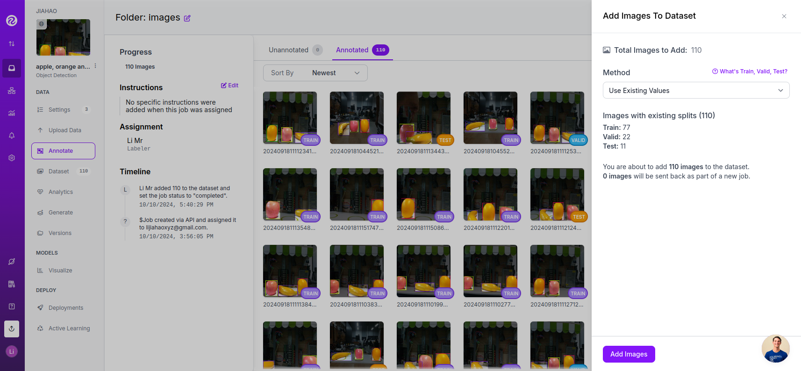
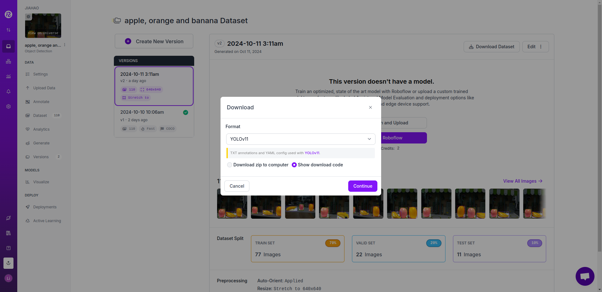

---


sidebar_position: 1


---


> You can get this [Notebook](https://github.com/Seeed-Projects/Tutorial-of-AI-Kit-with-Raspberry-Pi-From-Zero-to-Hero/blob/main/articles/Chapter%205%20-%20Custom%20Model%20Development%20and%20Deployment/Training%20Your%20Model.ipynb) on GitHub.


## Step 1: Prepare you environment on your host computer


**Note：This part of code run on your host computer**


The Jupyter Notebook right up have a button like , then you choose ```Select Another Kernel```, and choose ```Python Environments```, then choose ```Creat Python Environment``` and choose ```Venv```, then choose ```python3.10```.


```python
# Here is my hostcomputer information, you should install Ubantu 22.04 if you what use this code.
# Linux PC 6.8.0-45-generic #45~22.04.1-Ubuntu SMP PREEMPT_DYNAMIC Wed Sep 11 15:25:05 UTC 2 x86_64 x86_64 x86_64 GNU/Linux.

!uname -a
```


```python
# Here is my python version, you should install python3.10.12 
# Python 3.10.12

!python -V
```


```python
# Install libs, if you see 'install successfully' it means you install libs successfully, or when you see 'install error' it means you install libs unsuccessfully
try:
    %pip install torch torchvision pycocotools opencv-python ultralytics matplotlib -q
    print('install successfully')
except:
    print('install error')

```


## Step 2: Prepare your dateset


I want to build a model to detect different fruit include banana, apple and orange. So I need to collect some pictures of this fruit. And I use [robflow](https://roboflow.com/) to label my dataset.


### Step 1: Create Project


Select ```New Project```:


Fill your project information and create the project





### Step 2: Update images and annotate


Update images


Label your image





### Step 3: Export dataset


Add annotated image to your dataset





Generate New version of your dataset


Download your dataset





```python
# Download gdown to install dataset from google driver, if you see 'install successfully' it means you install libs successfully, or when you see 'install error' it means you install libs unsuccessfully
try:
    %pip install gdown -q
    print('install successfully')
except:
    print('install error')
```


```python
# Download your dataset, and you can also train your model on roboflow   
!gdown https://drive.google.com/uc?id=1zZKnIVAcdNLUKg7IxaF-xLzE3Fvr3A05  && unzip roboflow.zip -d ~/datasets/ && rm roboflow.zip && mv ~/datasets/data.yaml ./data.yaml && cp -r ~/datasets/test/images ./
```


## Step 3: Training Yolo11n


YOLOv11 is the latest version in the YOLO (You Only Look Once) series developed by Ultralytics, following previous iterations like YOLOv5 and YOLOv8. It retains the key features of earlier versions, focusing on real-time object detection with improvements in speed, accuracy, and versatility across various tasks, such as object detection, segmentation, classification, and pose estimation.


```python
from ultralytics import YOLO

# Load a model
model = YOLO("yolo11n.pt") # load a pretrained model (recommended for training)
# Train model with 10 epochs
results = model.train(data="data.yaml", epochs=20, imgsz=640, batch=16)

```


```python
%matplotlib inline

import cv2
import os
import matplotlib.pyplot as plt
from ultralytics import YOLO

# Define the image directory path
image_dir = './images/'

# Get a list of all image files in the directory
image_files = [f for f in os.listdir(image_dir) if f.endswith(('.png', '.jpg', '.jpeg'))]

# Loop through each image in the directory
for image_file in image_files:
    image_path = os.path.join(image_dir, image_file)
    image = cv2.imread(image_path)

    # Perform prediction
    results = model(image)

    # Process the results and draw bounding boxes
    for result in results:
        # Extract bounding boxes
        boxes = result.boxes
        if boxes is not None:
            for box in boxes:
                x1, y1, x2, y2 = map(int, box.xyxy[0])  # Get bounding box coordinates
                conf = box.conf[0]  # Confidence score
                cls = int(box.cls[0])  # Class label index
                label = f"{model.names[cls]}: {conf:.2f}"  # Create label text

                # Draw the bounding box and label on the image
                cv2.rectangle(image, (x1, y1), (x2, y2), (0, 255, 0), 2)  # Green box
                cv2.putText(image, label, (x1, y1 - 10), cv2.FONT_HERSHEY_SIMPLEX, 0.5, (0, 255, 0), 2)  # Green label

    # Convert BGR image (from OpenCV) to RGB for displaying with matplotlib
    image_rgb = cv2.cvtColor(image, cv2.COLOR_BGR2RGB)

    # Display the result image using matplotlib
    plt.figure(figsize=(10, 6))
    plt.imshow(image_rgb)
    plt.axis('off')  # Hide axis
    plt.title(f"YOLO Prediction - {image_file}")
    plt.show()

```


## Step 4: Export to ONNX format


I will use Hailo DataFlow Compiler to convert model to hef format to inference on AI Kit, so I need to convert model to onnx format.


```python
# Export Yolov11n model to onnx format, the path will be shown as below
# For me the path is /home/jiahao/Tutorial-of-AI-Kit-with-Raspberry-Pi-From-Zero-to-Hero/runs/detect/train/weights/best.onnx

model.export(format="onnx", opset=10)
```


