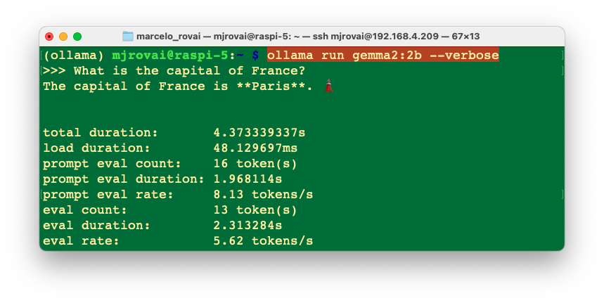

# Google Gemma 2 2B
## Introduction
Let's install [Gemma 2](https://ollama.com/library/gemma2:2b), a high-performing and efficient model available in three sizes: 2B, 9B, and 27B. We will install [**Gemma 2 2B**](https://huggingface.co/collections/google/gemma-2-2b-release-66a20f3796a2ff2a7c76f98f), a lightweight model trained with 2 trillion tokens that produce outsized results by learning from larger models through distillation. The model has 2.6 billion parameters and a Q4_0 quantization, which ends with a size of 1.6 GB. Its context window is 8,192 tokens. 


## Install Ollama 

Please refer to this [article](./Setup_Ollama_on_RaspberryPi)


## Install and run gemma2

```bash
ollama run gemma2:2b --verbose
```

Running the model with the command before, we should have the Ollama prompt available for us to input a question and start chatting with the LLM model; for example, 

`>>> What is the capital of France?` 

Almost immediately, we get the correct answer: 

`The capital of France is **Paris**. 🗼` 	 

And it' statistics.



We can see that Gemma 2:2B has around the same performance as Lama 3.2:3B, but having less parameters. 

**Other examples:**

```bash
>>> What is the distance between Paris and Santiago, Chile?

The distance between Paris, France and Santiago, Chile is 
approximately **7,000 miles (11,267 kilometers)**. 

Keep in mind that this is a straight-line distance, and actual 
travel distance can vary depending on the chosen routes and any 
stops along the way. ✈️`
```

Also, a good response but less accurate than Llama3.2:3B.

```bash
>>> what is the latitude and longitude of Paris?

You got it! Here are the latitudes and longitudes of Paris, 
France:

* **Latitude:** 48.8566° N (north)
* **Longitude:** 2.3522° E (east) 

Let me know if you'd like to explore more about Paris or its 
location! 🗼🇫🇷 
```

A good and accurate answer (a little more verbose than the Llama answers).
