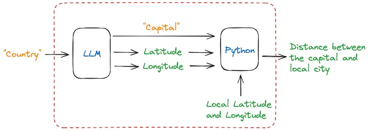
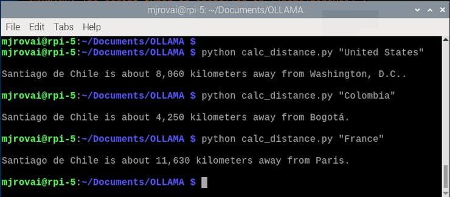
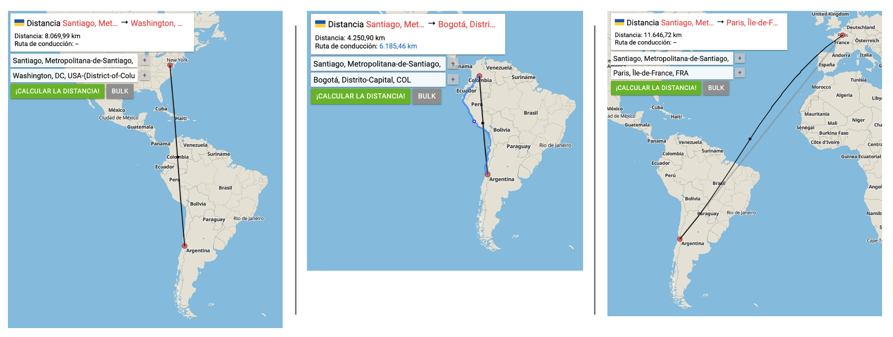
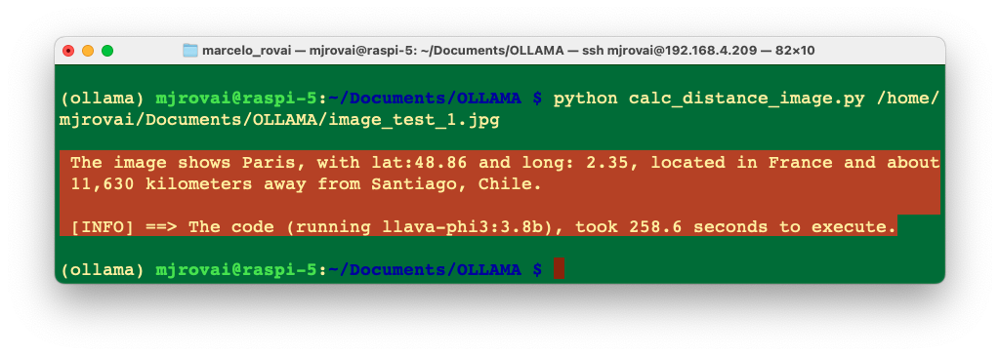

# Let's create a project.

We want to create an *app* where the user enters a country's name and gets, as an output, the distance in km from the capital city of such a country and the app's location (for simplicity, We will use Santiago, Chile, as the app location).



Once the user enters a country name, the model will return the name of its capital city (as a string) and the latitude and longitude of such city (in float). Using those coordinates, we can use a simple Python library ([haversine](https://pypi.org/project/haversine/)) to calculate the distance between those 2 points.

The idea of this project is to demonstrate a combination of language model interaction (IA), structured data handling with Pydantic, and geospatial calculations using the Haversine formula (traditional computing).

First, let us install some libraries. Besides *Haversine*, the main one is the [OpenAI Python library](https://github.com/openai/openai-python), which provides convenient access to the OpenAI REST API from any Python 3.7+ application. The other one is [Pydantic](https://docs.pydantic.dev/latest/) (and instructor), a robust data validation and settings management library engineered by Python to enhance the robustness and reliability of our codebase. In short, *Pydantic* will help ensure that our model's response will always be consistent.

## Install Necessary Packages

```bash
pip install haversine
pip install openai 
pip install pydantic 
pip install instructor
```

Now, we should create a Python script designed to interact with our model (LLM) to determine the coordinates of a country's capital city and calculate the distance from Santiago de Chile to that capital.

Let's go over the code:

## 1.  Importing Libraries

```python
import sys
from haversine import haversine
from openai import OpenAI
from pydantic import BaseModel, Field
import instructor
```

- **sys**: Provides access to system-specific parameters and functions. It's used to get command-line arguments.
- **haversine**: A function from the haversine library that calculates the distance between two geographic points using the Haversine formula.
- **openAI**: A module for interacting with the OpenAI API (although it's used in conjunction with a local setup, Ollama). Everything is off-line here.
- **pydantic**: Provides data validation and settings management using Python-type annotations. It's used to define the structure of expected response data.
- **instructor**: A module is used to patch the OpenAI client to work in a specific mode (likely related to structured data handling).

## 2.  Defining Input and Model

```python
country = sys.argv[1]  		# Get the country from command-line arguments
MODEL = 'phi3.5:3.8b'     # The name of the model to be used
mylat = -33.33         		# Latitude of Santiago de Chile
mylon = -70.51        		# Longitude of Santiago de Chile
```

- **country**: On a Python script, getting the country name from command-line arguments is possible. On a Jupyter notebook, we can enter its name, for example,
    - `country = "France"`

- **MODEL**: Specifies the model being used, which is, in this example, the phi3.5. 
- **mylat** **and** **mylon**: Coordinates of Santiago de Chile, used as the starting point for the distance calculation.

## 3.  Defining the Response Data Structure

```python
class CityCoord(BaseModel):
    city: str = Field(..., description="Name of the city")
    lat: float = Field(..., description="Decimal Latitude of the city")
    lon: float = Field(..., description="Decimal Longitude of the city")
```

- **CityCoord**: A Pydantic model that defines the expected structure of the response from the LLM. It expects three fields: city (name of the city), lat (latitude), and lon (longitude).

### 4.  Setting Up the OpenAI Client

```python
client = instructor.patch(
    OpenAI(
        base_url="http://localhost:11434/v1",  # Local API base URL (Ollama)
        api_key="ollama",                      # API key (not used)
    ),
    mode=instructor.Mode.JSON,                 # Mode for structured JSON output
)
```

- **OpenAI**: This setup initializes an OpenAI client with a local base URL and an API key (ollama). It uses a local server.
- **instructor.patch**: Patches the OpenAI client to work in JSON mode, enabling structured output that matches the Pydantic model.

## 5.  Generating the Response

```python
resp = client.chat.completions.create(
    model=MODEL,
    messages=[
        {
            "role": "user",
            "content": f"return the decimal latitude and decimal longitude \
            of the capital of the {country}."
        }
    ],
    response_model=CityCoord,
    max_retries=10
)
```

- **client.chat.completions.create**: Calls the LLM to generate a response.
- **model**: Specifies the model to use (llava-phi3).
- **messages**: Contains the prompt for the LLM, asking for the latitude and longitude of the capital city of the specified country.
- **response_model**: Indicates that the response should conform to the CityCoord model.
- **max_retries**: The maximum number of retry attempts if the request fails.

## 6.  Calculating the Distance

```python
distance = haversine((mylat, mylon), (resp.lat, resp.lon), unit='km')
print(f"Santiago de Chile is about {int(round(distance, -1)):,} \
        kilometers away from {resp.city}.")
```

- **haversine**: Calculates the distance between Santiago de Chile and the capital city returned by the LLM using their respective coordinates.
- **(mylat, mylon)**: Coordinates of Santiago de Chile.
- **resp.city**: Name of the country's capital 
- **(resp.lat, resp.lon)**: Coordinates of the capital city are provided by the LLM response.
- **unit='km'**: Specifies that the distance should be calculated in kilometers.
- **print**: Outputs the distance, rounded to the nearest 10 kilometers, with thousands of separators for readability.

**Running the code**

If we enter different countries, for example, France, Colombia, and the United States,  We can note that we always receive the same structured information:

```bash
Santiago de Chile is about 8,060 kilometers away from Washington, D.C..
Santiago de Chile is about 4,250 kilometers away from Bogotá.
Santiago de Chile is about 11,630 kilometers away from Paris.
```

If you run the code as a script, the result will be printed on the terminal:



And the calculations are pretty good!



> In the [20-Ollama_Function_Calling](https://github.com/Mjrovai/EdgeML-with-Raspberry-Pi/blob/main/OLLAMA_SLMs/20-Ollama_Function_Calling.ipynb) notebook, it is possible to find experiments with all models installed. 

## Adding images

Now it is time to wrap up everything so far! Let's modify the script so that instead of entering the country name (as a text), the user enters an image, and the application (based on SLM) returns the city in the image and its geographic location. With those data, we can calculate the distance as before.


For simplicity, we will implement this new code in two steps. First, the LLM will analyze the image and create a description (text). This text will be passed on to another instance, where the model will extract the information needed to pass along.

We will start importing the libraries

```python
import sys
import time
from haversine import haversine
import ollama
from openai import OpenAI
from pydantic import BaseModel, Field
import instructor
```

We can see the image if you run the code on the Jupyter Notebook. For that we need also import:

```python
import matplotlib.pyplot as plt
from PIL import Image
```

> Those libraries are unnecessary if we run the code as a script. 

Now, we define the model and the local coordinates:

```python
MODEL = 'llava-phi3:3.8b'
mylat = -33.33
mylon = -70.51
```

We can download a new image, for example, Machu Picchu from Wikipedia. On the Notebook we can see it:

```python
# Load the image
img_path = "image_test_3.jpg"
img = Image.open(img_path)

# Display the image
plt.figure(figsize=(8, 8))
plt.imshow(img)
plt.axis('off')
#plt.title("Image")
plt.show()
```


Now, let's define a function that will receive the image and will `return the decimal latitude and decimal longitude of the city in the image, its name, and what country it is located`

```python
def image_description(img_path):
    with open(img_path, 'rb') as file:
        response = ollama.chat(
            model=MODEL,
            messages=[
              {
                'role': 'user',
                'content': '''return the decimal latitude and decimal longitude 
                              of the city in the image, its name, and 
                              what country it is located''',
                'images': [file.read()],
              },
            ],
            options = {
              'temperature': 0,
              }
      )
    #print(response['message']['content'])
    return response['message']['content']
```

> We can print the entire response for debug purposes. 

The image description generated for the function will be passed as a prompt for the model again.

```python
start_time = time.perf_counter()  # Start timing

class CityCoord(BaseModel):
    city: str = Field(..., description="Name of the city in the image")
    country: str = Field(..., description="""Name of the country where"
                                             the city in the image is located
                                             """)
    lat: float = Field(..., description="""Decimal Latitude of the city in"
                                            the image""")
    lon: float = Field(..., description="""Decimal Longitude of the city in"
                                           the image""")

# enables `response_model` in create call
client = instructor.patch(
    OpenAI(
        base_url="http://localhost:11434/v1",
        api_key="ollama"
    ),
    mode=instructor.Mode.JSON,
)

image_description = image_description(img_path)
# Send this description to the model
resp = client.chat.completions.create(
    model=MODEL,
    messages=[
        {
            "role": "user",
            "content": image_description,
        }
    ],
    response_model=CityCoord,
    max_retries=10,
    temperature=0,
)
```

If we print the image description , we will get:

```bash
The image shows the ancient city of Machu Picchu, located in Peru. The city is
perched on a steep hillside and consists of various structures made of stone. It 
is surrounded by lush greenery and towering mountains. The sky above is blue with
scattered clouds. 

Machu Picchu's latitude is approximately 13.5086° S, and its longitude is around
72.5494° W.
```

And the second response from the model  (` resp`) will be:

```bash
CityCoord(city='Machu Picchu', country='Peru', lat=-13.5086, lon=-72.5494)
```

Now, we can do a "Post-Processing", calculating the distance and preparing the final answer:

```python
distance = haversine((mylat, mylon), (resp.lat, resp.lon), unit='km')

print(f"\n The image shows {resp.city}, with lat:{round(resp.lat, 2)} and \
      long: {round(resp.lon, 2)}, located in {resp.country} and about \
            {int(round(distance, -1)):,} kilometers away from \
            Santiago, Chile.\n")

end_time = time.perf_counter()  # End timing
elapsed_time = end_time - start_time  # Calculate elapsed time
print(f" [INFO] ==> The code (running {MODEL}), took {elapsed_time:.1f} \
      seconds to execute.\n")
```

And we will get:

```bash
 The image shows Machu Picchu, with lat:-13.16 and long: -72.54, located in Peru
 and about 2,250 kilometers away from Santiago, Chile.

 [INFO] ==> The code (running llava-phi3:3.8b), took 491.3 seconds to execute.
```

In the [30-Function_Calling_with_images](https://github.com/Mjrovai/EdgeML-with-Raspberry-Pi/blob/main/OLLAMA_SLMs/30-Function_Calling_with_images.ipynb) notebook, it is possible to find the experiments with multiple images.

Let's now download the script  `calc_distance_image.py` from the [GitHub](https://github.com/Mjrovai/EdgeML-with-Raspberry-Pi/blob/main/OLLAMA_SLMs/calc_distance_image.py) and run it on the terminal with the command:

```bash
python calc_distance_image.py /home/mjrovai/Documents/OLLAMA/image_test_3.jpg
```


Enter with the Machu Picchu image full patch as an argument. We will get the same previous result.


*How* about Paris?



Of course, there are many ways to optimize the code used here. Still, the idea is to explore the considerable potential of *function calling* with SLMs at the edge, allowing those models to integrate with external functions or APIs. Going beyond text generation, SLMs can access real-time data, automate tasks, and interact with various systems.

## Resources

- [calc_distance_image python script](https://github.com/Mjrovai/EdgeML-with-Raspberry-Pi/blob/main/OLLAMA_SLMs/calc_distance_image.py)