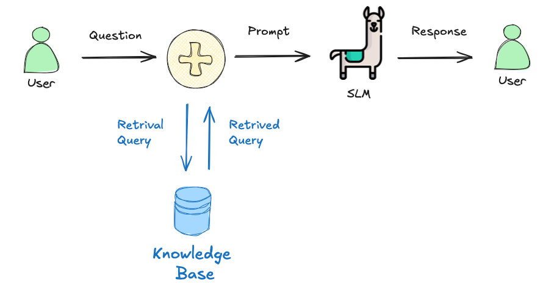
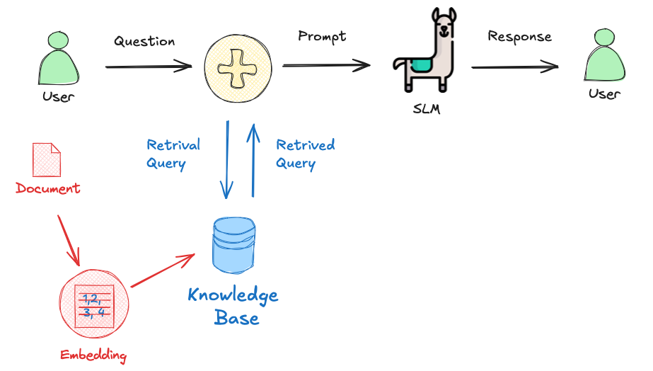

# SLMs: Optimization Techniques

Large Language Models (LLMs) have revolutionized natural language processing, but their deployment and optimization come with unique challenges. One significant issue is the tendency for LLMs (and more, the SLMs) to generate plausible-sounding but factually incorrect information, a phenomenon known as **hallucination**. This occurs when models produce content that seems coherent but is not grounded in truth or real-world facts. 

Other challenges include the immense computational resources required for training and running these models, the difficulty in maintaining up-to-date knowledge within the model, and the need for domain-specific adaptations. Privacy concerns also arise when handling sensitive data during training or inference. Additionally, ensuring consistent performance across diverse tasks and maintaining ethical use of these powerful tools present ongoing challenges. Addressing these issues is crucial for the effective and responsible deployment of LLMs in real-world applications.

The fundamental techniques for enhancing LLM (and SLM) performance and efficiency are Fine-tuning, Prompt engineering, and Retrieval-Augmented Generation (RAG). 

- **Fine-tuning**, while more resource-intensive, offers a way to specialize LLMs for particular domains or tasks. This process involves further training the model on carefully curated datasets, allowing it to adapt its vast general knowledge to specific applications. Fine-tuning can lead to substantial improvements in performance, especially in specialized fields or for unique use cases.

- **Prompt engineering** is at the forefront of LLM optimization. By carefully crafting input prompts, we can guide models to produce more accurate and relevant outputs. This technique involves structuring queries that leverage the model's pre-trained knowledge and capabilities, often incorporating examples or specific instructions to shape the desired response.

- **Retrieval-Augmented Generation (RAG)** represents another powerful approach to improving LLM performance. This method combines the vast knowledge embedded in pre-trained models with the ability to access and incorporate external, up-to-date information. By retrieving relevant data to supplement the model's decision-making process, RAG can significantly enhance accuracy and reduce the likelihood of generating outdated or false information.

For edge applications, it is more beneficial to focus on techniques like RAG that can enhance model performance without needing on-device fine-tuning. Let's explore it. 

## RAG Implementation

In a basic interaction between a user and a language model, the user asks a question, which is sent as a prompt to the model. The model generates a response based solely on its pre-trained knowledge. In a RAG process, there's an additional step between the user's question and the model's response. The user's question triggers a retrieval process from a knowledge base. 



## A simple RAG project

Here are the steps to implement a basic Retrieval Augmented Generation (RAG):

- **Determine the type of documents you'll be using:** The best types are documents from which we can get clean and unobscured text. PDFs can be problematic because they are designed for printing, not for extracting sensible text. To work with PDFs, we should get the source document or use tools to handle it. 

- **Chunk the text:** We can't store the text as one long stream because of context size limitations and the potential for confusion. Chunking involves splitting the text into smaller pieces. Chunk text has many ways, such as character count, tokens, words, paragraphs, or sections. It is also possible to overlap chunks.

- **Create embeddings:** Embeddings are numerical representations of text that capture semantic meaning. We create embeddings by passing each chunk of text through a particular embedding model. The model outputs a vector, the length of which depends on the embedding model used. We should pull one (or more) [embedding models](https://ollama.com/blog/embedding-models) from Ollama, to perform this task. Here are some examples of embedding models available at Ollama. 

    | Model             | Parameter Size | Embedding Size |
    | ----------------- | -------------- | -------------- |
    | mxbai-embed-large | 334M           | 1024           |
    | nomic-embed-text  | 137M           | 768            |
    | all-minilm        | 23M            | 384            |

    > Generally, larger embedding sizes capture more nuanced information about the input. Still, they also require more computational resources to process, and a higher number of parameters should increase the latency (but also the quality of the response). 

- **Store the chunks and embeddings in a vector database:** We will need a way to efficiently find the most relevant chunks of text for a given prompt, which is where a vector database comes in. We will use [Chromadb](https://www.trychroma.com/), an AI-native open-source vector database, which simplifies building RAGs by creating knowledge, facts, and skills pluggable for LLMs. Both the embedding and the source text for each chunk are stored.

- **Build the prompt:** When we have a question, we create an embedding and query the vector database for the most similar chunks. Then, we select the top few results and include their text in the prompt. 

The goal of RAG is to provide the model with the most relevant information from our documents, allowing it to generate more accurate and informative responses. So, let's implement a simple example of an SLM incorporating a particular set of facts about bees ("Bee Facts"). 

Inside the `ollama` env, enter the command in the terminal for Chromadb instalation:

```bash
pip install ollama chromadb
```

Let's pull an intermediary embedding model, `nomic-embed-text`

```bash
ollama pull nomic-embed-text
```

And create a working directory:

```python
cd Documents/OLLAMA/
mkdir RAG-simple-bee
cd RAG-simple-bee/
```

Let's create a new Jupyter notebook, [40-RAG-simple-bee](https://github.com/Mjrovai/EdgeML-with-Raspberry-Pi/blob/main/OLLAMA_SLMs/40-RAG-simple-bee.ipynb) for some exploration:

Import the needed libraries:

```python
import ollama
import chromadb
import time
```

And define aor models:

```python
EMB_MODEL = "nomic-embed-text"
MODEL = 'llama3.2:3B'
```


Initially, a knowledge base about bee facts should be created. This involves collecting relevant documents and converting them into vector embeddings. These embeddings are then stored in a vector database, allowing for efficient similarity searches later. Enter with the "document," a base of "bee facts" as a list:

```python
documents = [
    "Bee-keeping, also known as apiculture, involves the maintenance of bee \
    colonies, typically in hives, by humans.",
    "The most commonly kept species of bees is the European honey bee (Apis \
    mellifera).",
    
    ...
    
    "There are another 20,000 different bee species in the world.",  
    "Brazil alone has more than 300 different bee species, and the \
    vast majority, unlike western honey bees, don’t sting.", 
    "Reports written in 1577 by Hans Staden, mention three native bees \
    used by indigenous people in Brazil.",
    "The indigenous people in Brazil used bees for medicine and food purposes",
    "From Hans Staden report: probable species: mandaçaia (Melipona \
    quadrifasciata), mandaguari (Scaptotrigona postica) and jataí-amarela \
    (Tetragonisca angustula)."
]
```

> We do not need to "chunk" the document here because we will use each element of the list and a chunk.

Now, we will create our vector embedding database  `bee_facts` and store the document in it:

```python
client = chromadb.Client()
collection = client.create_collection(name="bee_facts")

# store each document in a vector embedding database
for i, d in enumerate(documents):
  response = ollama.embeddings(model=EMB_MODEL, prompt=d)
  embedding = response["embedding"]
  collection.add(
    ids=[str(i)],
    embeddings=[embedding],
    documents=[d]
  )
```

Now that we have our "Knowledge Base" created, we can start making queries, retrieving data from it:



**User Query:** The process begins when a user asks a question, such as "How many bees are in a colony? Who lays eggs, and how much? How about common pests and diseases?"

```python
prompt = "How many bees are in a colony? Who lays eggs and how much? How about\
          common pests and diseases?"
```

**Query Embedding:** The user's question is converted into a vector embedding using **the same embedding model** used for the knowledge base.

```python
response = ollama.embeddings(
  prompt=prompt,
  model=EMB_MODEL
)
```

**Relevant Document Retrieval:** The system searches the knowledge base using the query embedding to find the most relevant documents (in this case, the 5 more probable). This is done using a similarity search, which compares the query embedding to the document embeddings in the database.

```python
results = collection.query(
  query_embeddings=[response["embedding"]],
  n_results=5
)
data = results['documents']
```

**Prompt Augmentation:** The retrieved relevant information is combined with the original user query to create an augmented prompt. This prompt now contains the user's question and pertinent facts from the knowledge base.

```python
prompt=f"Using this data: {data}. Respond to this prompt: {prompt}",
```

**Answer Generation:** The augmented prompt is then fed into a language model, in this case, the `llama3.2:3b` model. The model uses this enriched context to generate a comprehensive answer. Parameters like temperature, top_k, and top_p are set to control the randomness and quality of the generated response.

```python
output = ollama.generate(
  model=MODEL,
  prompt=f"Using this data: {data}. Respond to this prompt: {prompt}",
  options={
    "temperature": 0.0,
    "top_k":10,
    "top_p":0.5                          }
)
```

**Response Delivery:** Finally, the system returns the generated answer to the user. 

```python
print(output['response'])
```

```bash
Based on the provided data, here are the answers to your questions:

1. How many bees are in a colony?
A typical bee colony can contain between 20,000 and 80,000 bees.

2. Who lays eggs and how much?
The queen bee lays up to 2,000 eggs per day during peak seasons.

3. What about common pests and diseases?
Common pests and diseases that affect bees include varroa mites, hive beetles,
and foulbrood.
```

Let's create a function to help answer new questions:

```python
def rag_bees(prompt, n_results=5, temp=0.0, top_k=10, top_p=0.5):
    start_time = time.perf_counter()  # Start timing
    
    # generate an embedding for the prompt and retrieve the data 
    response = ollama.embeddings(
      prompt=prompt,
      model=EMB_MODEL
    )
    
    results = collection.query(
      query_embeddings=[response["embedding"]],
      n_results=n_results
    )
    data = results['documents']
    
    # generate a response combining the prompt and data retrieved
    output = ollama.generate(
      model=MODEL,
      prompt=f"Using this data: {data}. Respond to this prompt: {prompt}",
      options={
        "temperature": temp,
        "top_k": top_k,
        "top_p": top_p                          }
    )
    
    print(output['response'])
    
    end_time = time.perf_counter()  # End timing
    elapsed_time = round((end_time - start_time), 1)  # Calculate elapsed time
    
    print(f"\n [INFO] ==> The code for model: {MODEL}, took {elapsed_time}s \
          to generate the answer.\n")
```

We can now create queries and call the function:

```python
prompt = "Are bees in Brazil?"
rag_bees(prompt)
```

```bash
Yes, bees are found in Brazil. According to the data, Brazil has more than 300
different bee species, and indigenous people in Brazil used bees for medicine and
food purposes. Additionally, reports from 1577 mention three native bees used by
indigenous people in Brazil.

 [INFO] ==> The code for model: llama3.2:3b, took 22.7s to generate the answer.
```

By the way, if the model used supports multiple languages, we can use it (for example, Portuguese), even if the dataset was created in English:

```python
prompt = "Existem abelhas no Brazil?"
rag_bees(prompt)
```

```bash
Sim, existem abelhas no Brasil! De acordo com o relato de Hans Staden, há três 
espécies de abelhas nativas do Brasil que foram mencionadas: mandaçaia (Melipona
quadrifasciata), mandaguari (Scaptotrigona postica) e jataí-amarela (Tetragonisca
angustula). Além disso, o Brasil é conhecido por ter mais de 300 espécies diferentes de abelhas, a maioria das quais não é agressiva e não põe veneno.

 [INFO] ==> The code for model: llama3.2:3b, took 54.6s to generate the answer.
```

## Going Further

The small LLM models tested worked well at the edge, both in text and with images, but of course, they had high latency regarding the last one. A combination of specific and dedicated models can lead to better results; for example, in real cases, an Object Detection model (such as YOLO) can get a general description and count of objects on an image that, once passed to an LLM, can help extract essential insights and actions.

According to Avi Baum, CTO at Hailo,

> In the vast landscape of artificial intelligence (AI), one of the most intriguing journeys has been the evolution of AI on the edge. This journey has taken us from classic machine vision to the realms of discriminative AI, enhancive AI, and now, the groundbreaking frontier of generative AI. Each step has brought us closer to a future where intelligent systems seamlessly integrate with our daily lives, offering an immersive experience of not just perception but also creation at the palm of our hand.


## Resources

- [40-RAG-simple-bee notebook](https://github.com/Mjrovai/EdgeML-with-Raspberry-Pi/blob/main/OLLAMA_SLMs/40-RAG-simple-bee.ipynb)